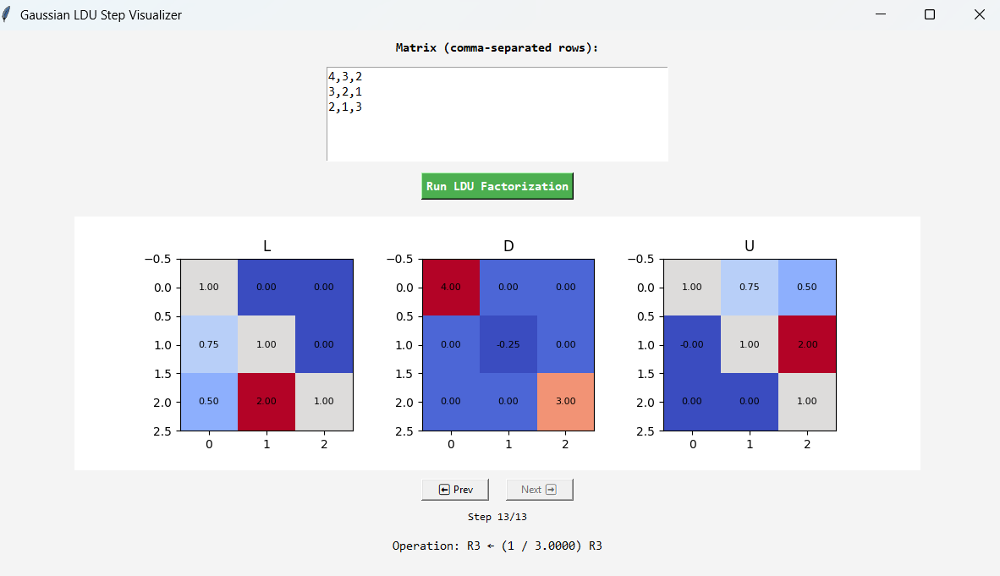

# 🧮 Gaussian Matrix Visualizer

A Python-based educational tool that illustrates **LDU matrix factorization** step by step with an interactive graphical interface.


## 🧱 Project Structure


```bash
gaussian-elimination-visualizer/

│

├── src/

│ ├── solver.py # Numerical algorithms (L, D, U factorization)

│ └── gui.py # Interactive Tkinter GUI 

├── main.py 

├── requirements.txt

└── README.md
```

## ⚙️ Installation

```bash
git clone https://github.com/<your-username>/gaussian-matrix-visualizer.git
cd gaussian-matrix-visualizer
pip install -r requirements.txt
```

## 🚀 Run the App

```bash
python main.py  
```

## 🧠 Features
- Step-by-step matrix update visualization
- Separate live figures for L, D, and U
- Backward / Forward control
- Custom matrix input
- Educational logs for teaching linear algebra

## 🧱 Example GUI Layout




---
**Author:** Shantiya  
**License:** MIT  
**GitHub:** [github.com/ShantiyaShamushaki](https://github.com/ShantiyaShamushaki)
